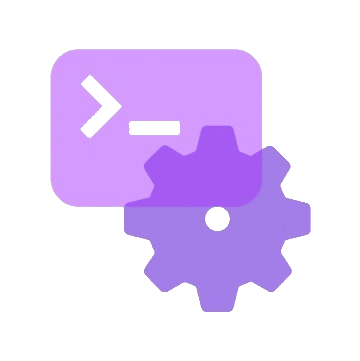

<h2> Hello, I'm Antonella Schillaci </h2>

<p><em>FrontEnd Developer  
</em></p>

<a href="https://www.linkedin.com/in/antonella-schillaci-frontend-dev/"></a> </br>


###  A little more about me...  

```javascript
const antonella = {
    pronouns: "She" | "Her",
    code: ["HTML", "JavaScript", "Typescript", "React", "Angular", "CSS", "SASS", "PHP", "Laravel"],
    askMeAbout: ["web dev", "tech", "app dev", "web design"],
    funFact: "There are two ways to write error-free programs; only the third one works"
};
```

 <em><b>I love connecting with different people</b> so if you want to say <b>hi, I'll be happy to meet you more!</b></em>
</br>

---
---
<b><em><h2> SKILLS </h2>


